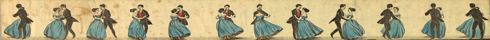

# OCTO_effects_extensionsA list of 'special effect' extensions for the Vuforia Studio platform

These include
* visual appearance extensions (reflective, translucent)
* visualisation techniques (see inside, simulated flow)

## Installation

Download the entire folder structure and unpack into the Vuforia/Studio installation/Extensions
directory.  Stop and restart Studio. The extensions widgets will now appear in the various control pallete locations.
 
## Details

### Directional Flow
A simple effect that will flow a specified image over a 3d model. The author can
choose the direction and speed, and can control the intensity of the effect.

The model parts (modelitems) to be affected must first be processed to include texture mapping coordinates (u,v) that represent the characteristics of the data
that is to 'flow'.  An example might be showing a fluid moving along a pipe, or electrical current moving along a cable.  This is not a true-to-life physical simulation, but a simple visualization technique
for presenting flow velocity (direction,speed).  Importantly, the widget does NOT provide or aid with the texture mapping process. That must be done in a CAD or DCC editor.  Simulation tools may also provide suitable model data.

The widget uses this mapping to then visualise the flow.  

#### Usage
Drag/drop the Flow widget into your scene. Identify then elements of your model that you wish to indicate there is some flow action going on. Assign Model Items to these elements.
In the Flow widget enter the IDs of the various modelitems in the 'Affects' field. This accepts a comma-separated list of IDs.  

If your AR experience is based around a physical product, using a Model Target for example, set the Physical Model property to true (check the box).  The Flow widget will disply the simulated flow in a way that woks well for physical overlay.

The U.V Velocity fields describe how the flow image moves over time.  UV mapping is described separately but in essence the surface is mapped against two parameters (u,v) and the Velocity settings define the speed and direction that the
mapped image will move along these parameters.  

Repeats (U) and (V) are similar; the default value of 1 means the applied image would appear once on a surface.  Change the values of Repeats (U) and (V) to show more or fewer.

The Intensity property can be used to dial back the flow effect, making it blend in better. This is particularly useful on physical products.

The Image property allows you to specify a visual representation of your flow. A simple example might be an arrow that points in the direction of flow.

### Flipbook Animation
This widget provides the means to do simple flipbook / stop motion animation where a series of images are presented onto a surface, one at a time.  The resulting effect is the impression of animation as each of the images changes.

#### Usage
Drag/drop the Flipbook widget into your scene. Identify then elements of your model that you wish to indicate there is some animation going on. ModelItems and Images are supported.
In the Flipbook widget, enter the IDs of the various modelitems/images in the 'Affects' field. This accepts a comma-separated list of IDs.  

If your AR experience is based around a physical product, using a Model Target for example, set the Physical Model property to true (check the box).  

The Speed field controls the frequencey of the animation i.e. how quickly the images change. 
Direction defines the order that the images are applied.  
The Intensity property can be used to dial back the flow effect, making it blend in better. This is particularly useful on physical products.

The Image property references an image that contains you animation. The animation is defined as a series of 'frames', which are stored inside the image, effectively one image 
next to the previous, increasing in width.  The Frames property should be set to indicate the number of frames included in the image.

### See Inside
This widget will control the effect of showing selected parts (model items) that are located within some physical or virtual object.

### See Reflection
This widget will apply a reflection effect to specified model parts.

### See Through
This widget will apply a transparency effect similar to glass; slightly reflective (based on incedence angle) but also transparent.
